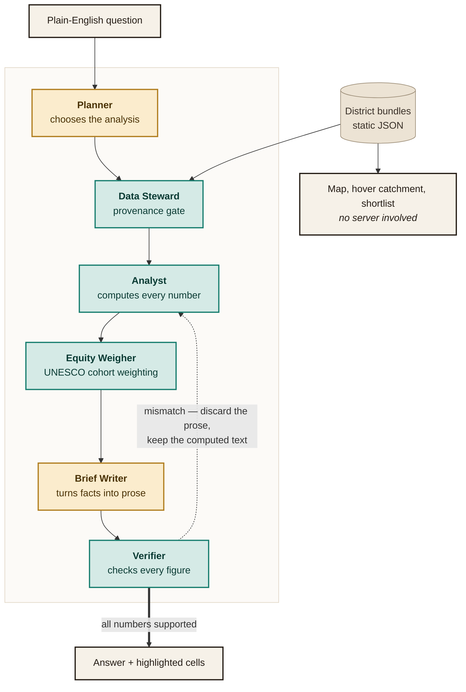

# Rasta

**Where should the next school go?** Rasta helps an education NGO in Pakistan find where
children live beyond a 15-minute walk of a school, and which sites to field-verify first.

> *"Where should we open learning centres in Tharparkar?"*
> *"How many girls are beyond a 30 minute walk in Dadu?"*
> *"Compare these districts"*

- **The story:** https://arahmanmdmajid-rasta-school-access.static.hf.space
- **The app:** https://arahmanmdmajid-rasta-school-access.static.hf.space/map.html
- **API docs:** https://rasta-api-2019.onrender.com/docs

> The map, the hover catchment, the choropleth and the shortlist are static files and work
> instantly. Only the natural-language panel calls the API, which sleeps on the free tier
> and can take up to a minute to wake.

---

## Why

UNESCO's 2026 Global Education Monitoring Report puts Pakistan second in the world for
out-of-school children — about 26.2 million — and finds that **girls aged 10–12 who walk
45–60 minutes to school are 15% less likely to attend** than those within 15 minutes.
UNICEF counted roughly 18,000 schools damaged in the 2025 floods. The IMF's Resilience and
Sustainability Facility now requires Pakistan to reflect climate considerations in how
public investment is selected.

All three point at one spatial question nobody is answering: *which children are too far
from a school, and where would a new one help most?* Rasta answers it, and is honest about
how far the available data can carry the answer.

## What it does

| You can… | How |
|---|---|
| See where children are far from a school | A walk-time choropleth over 400 m population cells |
| Test a site before committing to it | Move the cursor: a 15-minute walking catchment follows it and reads out how many underserved children it would reach |
| Get a ranked list of places to visit | Greedy, spatially de-duplicated shortlist per district |
| Ask in plain English | A five-agent pipeline, with a verifier that can overrule the model |
| Judge how much to trust it | Every district reports how many of its schools exist in open data at all |
| See the urban/rural gradient | Central Karachi: 5% of children beyond a 15-minute walk. Tharparkar: 94% |

## The finding you should know before trusting any number

Open school data for Pakistan is radically incomplete, and we measured it rather than
assuming it. For Sindh, against roughly **48,000** government schools on the official count:

| Source | All Sindh | Tharparkar |
|---|---|---|
| OpenStreetMap | 1,571 | 2 |
| UNICEF Giga | 1,557 | 2 |
| **Overture Maps** | **6,042** | **228** |

Giga turned out to be OpenStreetMap-derived here, so it added almost nothing. Overture's
Pakistan schools come overwhelmingly from Meta (`meta=6,015` of those 6,042), which makes
it genuinely independent — and is the difference between Tharparkar being analysable and
being an artifact. Rasta uses **both**, de-duplicated at 75 m, which yields **6,390**
schools across Sindh's 29 districts and leaves no district with zero.

Even so, that is **13%** of the official count — roughly one school in eight. So Rasta measures distance to the nearest
**mapped** school, labels every district with its completeness, and presents its output as
**sites to field-verify** — never as confirmed gaps. A district showing few schools is
telling you about the map, not about the district.

## How it works



**Amber is a language model; teal is ordinary Python.** Two of the six boxes are models,
and neither has the final word — the dotted edge is the Verifier overruling the writer.

**The AI chooses; the code computes.** No number a user sees is produced by a language
model. The Planner picks an operation and fills parameters. The Analyst computes every
figure in ordinary Python. The Brief Writer is shown only the computed sentence and told
that every number it writes must already appear there — and then the **Verifier checks
that claim and discards the brief if it does not hold**, falling back to the computed text.

Measured over ten live questions: **10/10 verified, 9/10 written by the model**; the tenth
hit a Groq rate limit and fell back to computed text, which is the designed behaviour.

### What you can ask

| Operation | Question it answers |
|---|---|
| `gap` | "How many children are beyond a 30-minute walk?" |
| `shortlist` | "Where should we open learning centres?" |
| `poorest` | "Show me the least privileged areas" — ranks by relative wealth |
| `compare` | "Compare these districts" |
| `summary` | "Tell me about Dadu" |
| `explain` | "What does this map show?" · "What do the colours mean?" · "How accurate is this?" |

`explain` exists because the first things anyone asks are about the tool, not the data,
and refusing them made the assistant look broken rather than careful. Its answers are
assembled from config and the bundle rather than generated, so the Verifier still checks
every number. Answers that concern particular places — `gap`, `shortlist`, `poorest` —
also return the cells they are talking about, and the map outlines them.

Skills demonstrated: Multi-Agent Systems, Agentic AI, Generative AI, AI Workflows, and
AI-powered Business Process Automation — the process being automated is the district
prioritisation memo an officer would otherwise assemble by hand.

### The walk model, and why it is a circle

```
radius = minutes / 60 × 4 km/h × 1000 ÷ 1.3  →  15 minutes ≈ 769 m
```

- **4 km/h** is the assumption school-travel research uses for under-12s. Measured speeds
  for 10–12 year-olds are higher (4.5–4.7 km/h), so this is deliberately conservative: a
  slower speed yields longer times, and never understates the barrier.
- **1.3** is the standard circuity factor — network distance over straight-line distance.
- **15 minutes** is UNESCO's threshold, not a round number we chose.

Because the model is closed form, a catchment *is* a circle, which is what lets it follow
the cursor at full frame rate with no server call. A routing engine would be more accurate
and would make that interaction impossible. The trade is stated on screen, with the formula.

## Repository layout

```
api/
  app.py              FastAPI: /health, /districts, /district/{code}, /ask
  rasta/
    config.py         walk parameters, each with its citation
    planner.py        agent 1 — LLM routing, and the schema that constrains it
    bundles.py        agent 2 — bundle loading and the provenance gate
    analyst.py        agent 3 — every number, deterministically
    writer.py         agent 4 — LLM prose, in a briefing or explaining voice
    verifier.py       agent 5 — numeric check that can overrule agent 4
    pipeline.py       the orchestrator, and the trace it emits
scripts/
  fetch_data.py       boundaries, population, poverty
  fetch_giga.py       UNICEF Giga school locations
  fetch_overture.py   Overture school locations
  build_bundles.py    precomputes one JSON per district
  deploy_web.ps1      pushes web/ to the Hugging Face Space
web/
  index.html          the scrollytelling story (the site's entry point)
  map.html            the app: map, hover catchment, shortlist, ask panel
  districts/*.json    29 precomputed Sindh districts, plus their ODbL notice
tests/                115 tests, offline, under a second
```

Both pages are single self-contained files with no build step and no JavaScript
libraries beyond Leaflet on the map. The story page is 26 KB.

## Run it locally

Requirements: Python 3.12.

```bash
python -m venv .venv
.venv/Scripts/python -m pip install -r requirements-build.txt
cp .env.example .env            # add GROQ_API_KEY and GIGA_SCHOOL_LOCATION_API_KEY

python scripts/fetch_data.py
python scripts/fetch_giga.py
python scripts/fetch_overture.py
python scripts/build_bundles.py --province Sindh

python -m http.server 8780 --directory web     # story at /, app at /map.html
cd api && uvicorn app:app --port 7860          # the agent pipeline
```

Both pages work with the API down; only the ask panel needs it.

### Tests

```bash
.venv/Scripts/python -m pip install -r requirements-dev.txt
.venv/Scripts/python -m pytest
```

The suite is fully offline — no API key, no network. It asserts invariants and bounds
rather than measured values, so rebuilding the data does not break it.

## Deployment

- **Page + bundles** → Hugging Face **Static** Space (`scripts/deploy_web.ps1`).
- **API** → Render free tier (`render.yaml`). Only `GROQ_API_KEY` is needed there.

The Giga key is **build-time only** and never reaches the deployed service. The static page
holds no secrets at all.

## Limitations

- **Open school data is roughly 13% complete for Sindh.** Everything here is a shortlist to
  field-verify. This is the single most important caveat and it is shown in the product.
- **Distances are straight-line estimates with a detour factor, not routed along roads.**
  Fine for ranking; not a substitute for a routing engine where terrain is severe.
- **Child counts are estimates.** A national age share (30%) is applied uniformly to gridded
  population. Real age structure varies by district and between urban and rural areas.
- **The poverty signal is modelled, not measured.** Meta's Relative Wealth Index estimates
  *relative* wealth at ~2.4 km. It is used to rank areas, never to means-test anyone.
- **No dataset identifies girls' schools**, so girls are handled as a demand-side weight
  rather than by filtering supply — which is also closer to what UNESCO actually measured.
- **No school is known to be open or functioning.** "Mapped" is not "operating".

## Data sources and attribution

- **Schools:** [UNICEF Giga](https://maps.giga.global/) (ODbL — credit Giga and its
  contributors; partly derived from OpenStreetMap) and
  [Overture Maps Foundation](https://overturemaps.org/) places (CDLA-Permissive 2.0).
- **Population:** [Kontur Population Dataset](https://data.humdata.org/dataset/kontur-population-pakistan) (CC-BY).
- **Relative wealth:** [Meta Relative Wealth Index](https://data.humdata.org/dataset/relative-wealth-index) (CC-BY-NC).
- **Boundaries:** [OCHA Common Operational Datasets](https://data.humdata.org/dataset/cod-ab-pak) (CC-BY-IGO).
- **Official school counts:** Pakistan Institute of Education, *Pakistan Education Statistics*.
- **Basemap:** Esri World Light/Dark Gray Canvas.
- **Language model:** Groq, `openai/gpt-oss-120b`.

## Licence

Code: [MIT](LICENSE). Derived data in `web/districts/` is published under
**ODbL**, because it is built in part from ODbL sources — see [`web/districts/LICENSE`](web/districts/LICENSE).
Each upstream dataset keeps its own licence, listed above.

Rasta is a fork of [geomind-api](https://github.com/arahmanmdmajid/geomind-api) (MIT) by
the same author, which supplied the FastAPI structure, the "AI chooses, code computes"
pattern and the map page's theming. Git history is preserved.
